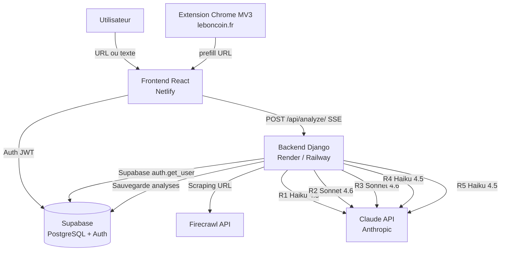
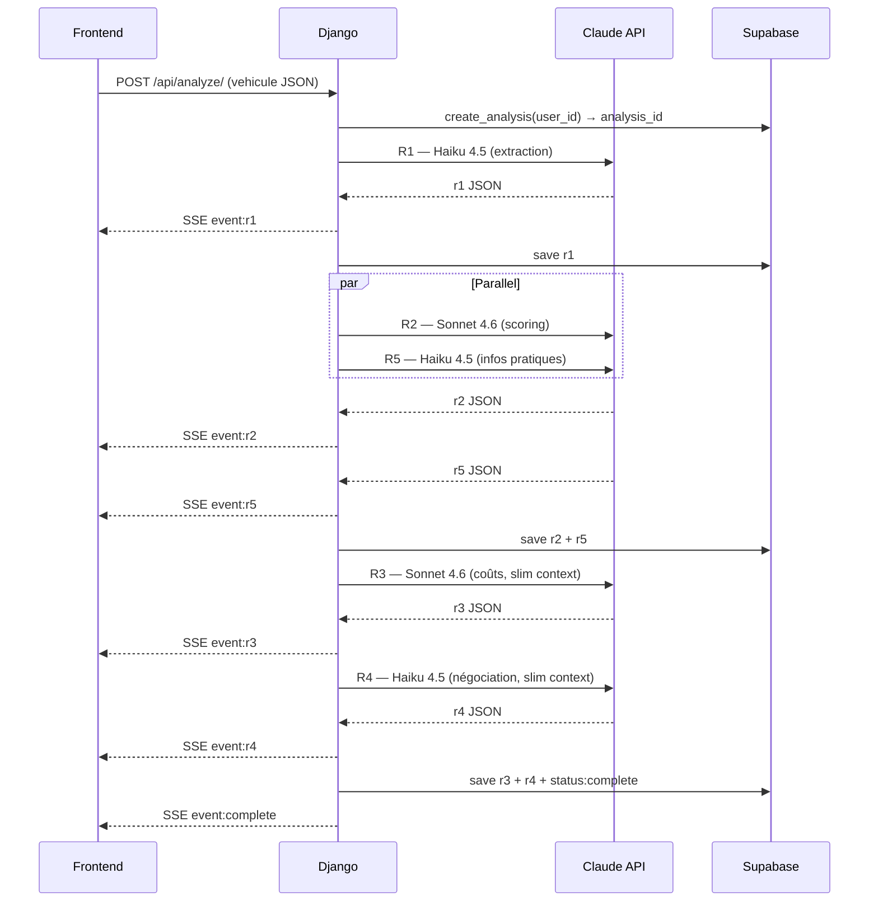
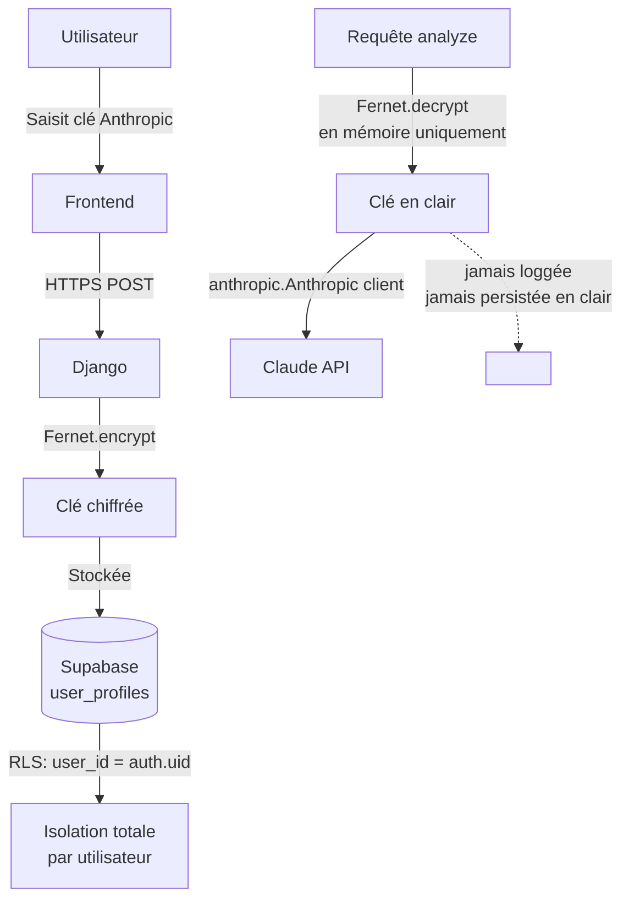

# ScanAuto

**Un rapport d'analyse complet sur une annonce de voiture d'occasion en moins de 60 secondes** — score global, fiabilité moteur, projection de coûts sur 5 ans et stratégie de négociation, à partir d'une simple URL ou d'un texte collé.

[](https://react.dev)
[](https://www.djangoproject.com)
[](https://www.anthropic.com)
[](https://developer.chrome.com/docs/extensions/mv3/intro/)
[](https://scanauto.netlify.app/)

**[→ App (scanauto.netlify.app)](https://scanauto.netlify.app/)** · **[→ Étude de cas complète sur mon portfolio](https://owenlebec.fr/projects/scanauto)**

---

## Contexte

ScanAuto est une application SaaS full-stack qui génère un rapport d'analyse complet sur une annonce de voiture d'occasion. L'utilisateur colle une URL ou un texte brut — leboncoin, lacentrale, AutoScout24 — et reçoit un score global, une analyse de fiabilité moteur, une projection de coûts sur 5 ans et une stratégie de négociation argumentée. Le projet est né d'un constat simple : les acheteurs de véhicules d'occasion n'ont pas les outils pour évaluer rapidement si une annonce est honnête ou piégée.

## Fonctionnalités clés

- Analyse depuis une URL d'annonce (scraping via Firecrawl) ou depuis un texte collé, voitures et motos
- Score global, analyse de fiabilité moteur, projection de coûts d'entretien à 2 et 5 ans, stratégie de négociation
- Résultat construit progressivement en temps réel (streaming SSE), sans attendre la fin du pipeline
- Extension Chrome pour leboncoin.fr : extraction en un clic, pré-remplissage direct du formulaire
- BYOK (Bring Your Own Key) : clé Anthropic personnelle chiffrée côté serveur, jamais stockée en clair
- Comparaison de plusieurs véhicules, checklist imprimable, rapport partageable publiquement
- Dégradation gracieuse : une étape du pipeline en échec n'empêche pas l'affichage des sections déjà complètes

## Stack technique

| Techno | Rôle |
|---|---|
| React 18 + Vite | SPA avec routing hash-based (sans serveur), lazy loading par page, `useReducer` pour l'état de l'analyse |
| Tailwind CSS 3 | Système de couleurs monochrome en variables CSS, dark/light sans JavaScript |
| Django 4.2 + DRF | Backend stateless — aucune base de données locale, pas de migrations, orienté orchestration d'API |
| Supabase | Auth JWT + PostgreSQL avec Row-Level Security (`user_id = auth.uid()`) |
| Anthropic Claude API | Haiku 4.5 pour les étapes rapides, Sonnet 4.6 pour les étapes analytiques, prompt caching `ephemeral` |
| Firecrawl | Extraction Markdown depuis les URLs d'annonces, gère les protections anti-bot |
| Chrome Extension MV3 | Content script sur leboncoin.fr, side panel, service worker — aucun build step |
| Gunicorn | 2 workers, 4 threads, timeout 300s pour les streams SSE longs |

## Architecture

### Vue d'ensemble



### Pipeline d'analyse

5 étapes avec parallélisme Python : R1 (extraction) → R2+R5 en parallèle via `threading.Thread` + `Queue` (scoring + infos pratiques) → R3 (coûts maintenance) → R4 (négociation). Le GIL Python ne bloque pas les I/O réseau : le gain est réel (~30 % de temps total). Chaque étape complète émet un événement SSE que le frontend dispatche dans un reducer, révélant les sections du rapport au fur et à mesure.



### Sécurité BYOK

Les clés Anthropic des utilisateurs sont chiffrées server-side avec Fernet (`cryptography` lib), déchiffrées en mémoire uniquement au moment de l'appel API. Le backend ne stocke jamais la clé en clair ; les utilisateurs gardent le contrôle de leurs quotas.



D'autres schémas (flux extension Chrome → app, sélection du modèle par étape, gestion d'état frontend) sont disponibles dans l'[étude de cas complète](https://owenlebec.fr/projects/scanauto).

## Points techniques notables

- **Calculs côté serveur avant tout appel LLM** — `km_par_an`, `age_vehicule`, `positionnement_pourcentage`, projections kilométriques à 2 et 5 ans sont tous calculés en Python avant d'être injectés comme faits immuables dans les prompts, pour éviter les erreurs de calcul des LLMs sur des valeurs critiques.
- **Context slimming pour R3 et R4** — ces étapes reçoivent uniquement les champs pertinents de R1/R2 (pas le JSON complet), économisant environ 30-40 % de tokens d'input sur ces deux appels.
- **Extraction JSON-LD dans l'extension Chrome** — le content script parse le `@type:Vehicle` JSON-LD de leboncoin en priorité (donnée structurée fiable), avec 4 stratégies de fallback sur le DOM pour les champs absents. Les données transitent via `chrome.storage.session` vers le side panel, puis vers l'app via URL prefill (`#/?prefill=<JSON>`).
- **Sélection du modèle par étape** — Haiku 4.5 pour les étapes rapides/simples (extraction, négociation, infos pratiques), Sonnet 4.6 pour les étapes analytiques (scoring, coûts de maintenance).
- **Schéma véhicule partagé** — `vehicle-schema.json` est la définition canonique des champs, partagée entre l'extension Chrome, le frontend React et le backend Django.

## Cloner et lancer en local

Prérequis : **Node.js 18+** (Vite 5), **Python 3.10+**, un projet [Supabase](https://supabase.com), une clé [Anthropic](https://console.anthropic.com) et une clé [Firecrawl](https://www.firecrawl.dev) (gratuites).

```bash
git clone https://github.com/OwenLB/scanauto-source.git
cd scanauto-source
```

### Backend

```bash
cd backend
pip install -r requirements.txt
cp .env.example .env   # renseigner les variables ci-dessous
python manage.py runserver   # http://localhost:8000
```

```env
DJANGO_SECRET_KEY=...             # clé secrète Django
DEBUG=True
ALLOWED_HOSTS=localhost,127.0.0.1
CORS_ALLOWED_ORIGINS=http://localhost:5173
SUPABASE_URL=...                  # URL du projet Supabase
SUPABASE_JWT_SECRET=...           # secret JWT Supabase (vérification des tokens)
SUPABASE_SERVICE_ROLE_KEY=...     # clé service role Supabase
ENCRYPTION_KEY=...                # clé Fernet pour chiffrer les clés Anthropic BYOK
FIRECRAWL_API_KEY=...             # clé API Firecrawl (scraping d'URL)
```

### Frontend

```bash
cd frontend
npm install
cp .env.example .env   # renseigner les variables ci-dessous
npm run dev   # http://localhost:5173, proxy /api → :8000
```

```env
VITE_API_URL=http://localhost:8000
VITE_SUPABASE_URL=...        # URL du projet Supabase
VITE_SUPABASE_ANON_KEY=...   # clé anon (publique) Supabase
```

### Extension Chrome

Aucun build step. Dans `chrome://extensions` : activer le mode développeur → **Charger l'extension non empaquetée** → sélectionner le dossier `chrome-extension/`.

## Structure du projet

```
backend/
  api/                → views.py (pipeline SSE), prompts.py, moto_prompts.py, urls.py
  scanauto/            → settings.py, urls.py, wsgi.py
frontend/src/
  pages/               → LandingPage, DashboardPage, ReportPage, ComparisonPage,
                          PrintChecklistPage, PublicReportPage, SettingsPage
  components/Report/    → sections du rapport, une par étape du pipeline
  hooks/useAnalyses.js   → SSE + reducer d'état de l'analyse
chrome-extension/
  content.js            → parsing JSON-LD + fallbacks DOM sur leboncoin.fr
  sidepanel.js           → side panel MV3
vehicle-schema.json      → schéma véhicule canonique, partagé par les 3 composants
```

## Voir le projet en contexte

Cette étude de cas détaille les choix produit, l'architecture complète et le reste des schémas : **[owenlebec.fr/projects/scanauto](https://owenlebec.fr/projects/scanauto)**

Plus de projets sur [owenlebec.fr](https://owenlebec.fr).
