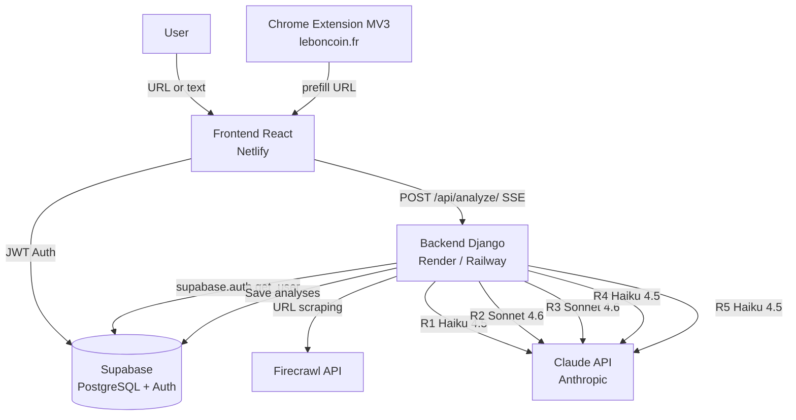
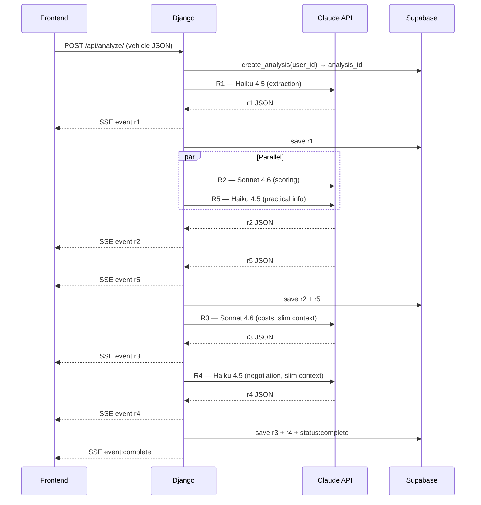
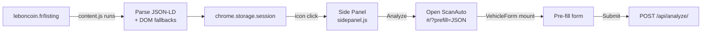
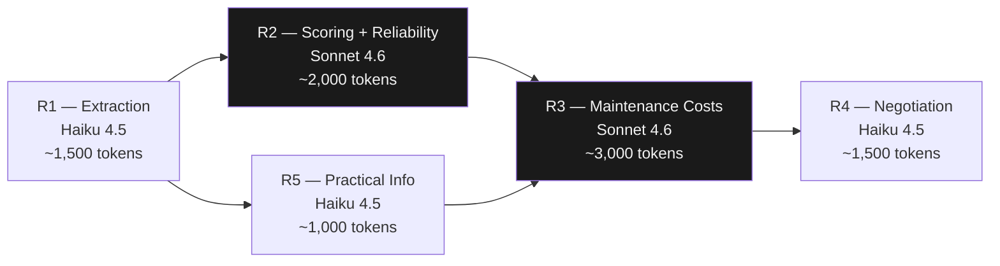
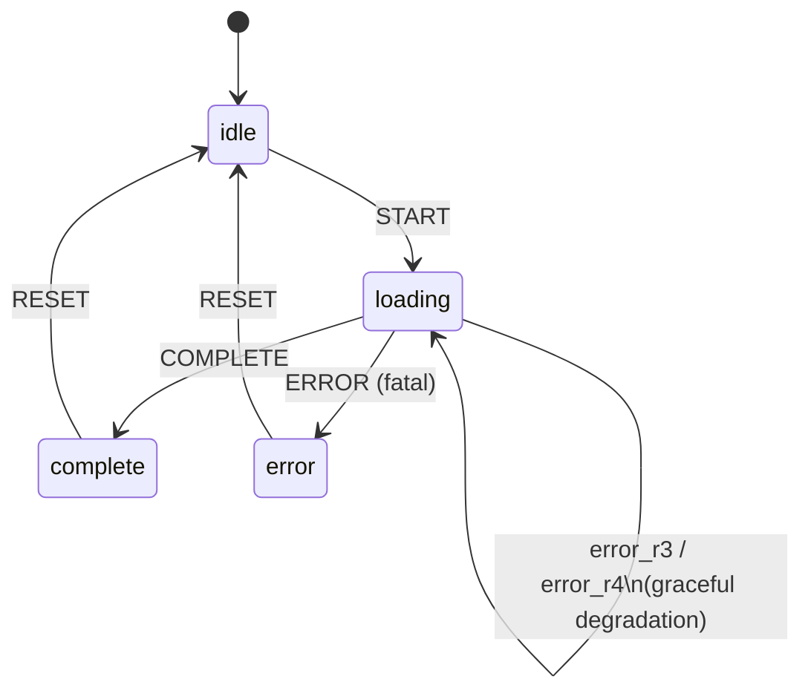
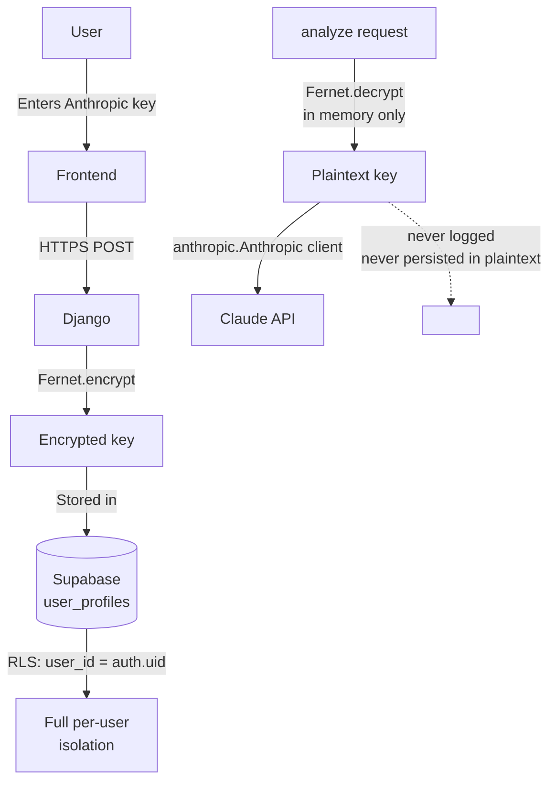

## Context

ScanAuto is a full-stack SaaS application that generates comprehensive analysis reports for used-car listings. The user pastes a URL or raw text — from leboncoin, lacentrale, or AutoScout24 — and receives within 60 seconds: a global score, engine reliability analysis, 5-year cost projection, and a data-backed negotiation strategy. The project was born from a simple observation: private buyers have no tooling to quickly assess whether a listing is honest or a trap.

## Stack & Architecture

- **React 18 + Vite** — SPA with hash-based routing (no server required), lazy-loaded pages, `useReducer` for analysis state management. Vite was chosen for its fast dev server and straightforward config compared to CRA.
- **Tailwind CSS 3 + CSS variables** — Monochrome color system defined as CSS variables (`--bg`, `--surface`, `--accent`…), dark/light switchable without JavaScript. Typography: Space Grotesk (display) + Inter (body).
- **Django 4.2 + DRF** — Stateless backend: no local database (`DATABASES = {}`), no migrations. Deliberate choice for a backend focused purely on API orchestration.
- **Supabase** — JWT auth + PostgreSQL with RLS (Row-Level Security). Every table filters on `user_id = auth.uid()` at the database layer — user isolation without application-level logic.
- **Anthropic Claude API (anthropic==0.40.0)** — Haiku 4.5 for fast/simpler steps (extraction, negotiation, practical info), Sonnet 4.6 for analytical depth (scoring, maintenance costs). Ephemeral prompt caching on all system prompts.
- **Firecrawl** — Markdown extraction from listing URLs. Handles anti-bot protections without manual HTML parsing; the resulting Markdown is injected directly into Claude.
- **Gunicorn** — 2 workers, 4 threads, 300s timeout for long SSE streams.
- **Chrome Extension MV3** — Content script on leboncoin.fr, side panel, service worker. No build step — plain JavaScript.

## Notable Technical Points

- **5-step pipeline with Python parallelism**: R1 (extraction) → R2+R5 in parallel via `threading.Thread` + `Queue` (scoring + practical info) → R3 (maintenance costs) → R4 (negotiation). Python's GIL doesn't block network I/O: the gain is real (~30% reduction in total pipeline time).

- **Server-side computations before any LLM call**: `km_per_year`, `vehicle_age`, `market_positioning_percentage`, kilometer projections at 2 and 5 years — all computed in Python and injected as immutable facts into the prompts. Eliminates LLM arithmetic errors on financially critical values.

- **Progressive SSE streaming**: each completed step emits an `event: r1|r2|…|complete` via SSE. The frontend dispatches each event into a reducer and reveals report sections incrementally. The user watches the report build in real time without waiting for the full pipeline.

- **Context slimming for R3 and R4**: these steps receive only the relevant fields from R1/R2 (not the full JSON), preventing token bloat on Sonnet. The savings are approximately 30–40% of input tokens on those two calls.

- **Encrypted BYOK (Bring Your Own Key)**: users' Anthropic keys are encrypted server-side with Fernet (Python `cryptography` lib), decrypted in memory only at call time. The backend never persists the key in plaintext; users keep full control over their quotas.

- **Chrome Extension MV3 — JSON-LD extraction**: the content script parses `@type:Vehicle` JSON-LD on leboncoin.fr first (reliable structured data), with 4 DOM fallback strategies for fields absent from JSON-LD (criteria, photos, description). Data flows through `chrome.storage.session` to the side panel, then to the app via URL prefill (`#/?prefill=<JSON>`).

- **Graceful degradation**: R3 and R4 can fail (timeout, API error) without blocking the report. The frontend displays a localized error state on the affected section; all previously completed sections remain visible.

## What I Built / Learned

The core challenge was designing the orchestration pipeline: managing step dependencies, controlled parallelism, timeouts, and partial error propagation — all while maintaining smooth client-side streaming. This forced me to treat each prompt as a contractual interface: strict inputs, schematized JSON outputs, explicit business rules to prevent hallucinations on financial data.

---

## Diagrams

### Global Architecture

---

### Analysis Pipeline (Sequence)

---

### Chrome Extension → App Flow

---

### Model Selection per Step

---

### Frontend State Machine (Reducer)

---

### BYOK Security Architecture

