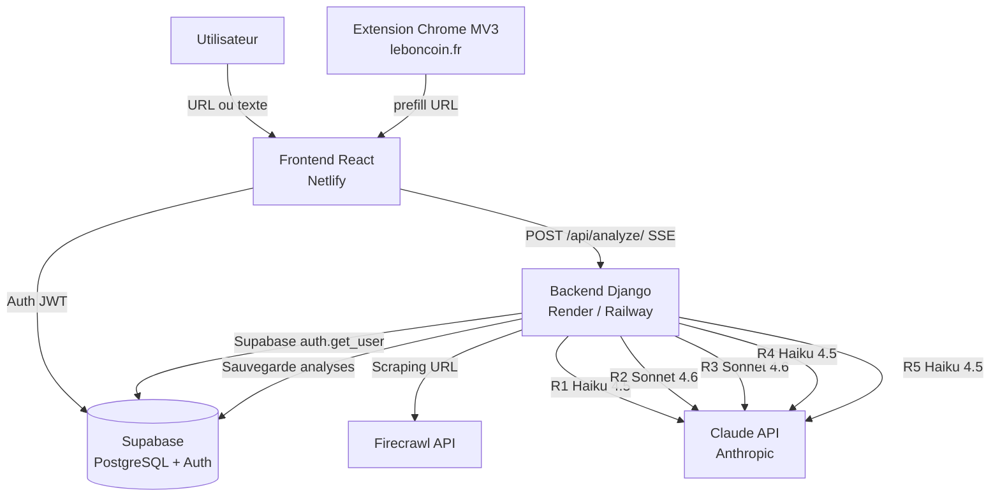
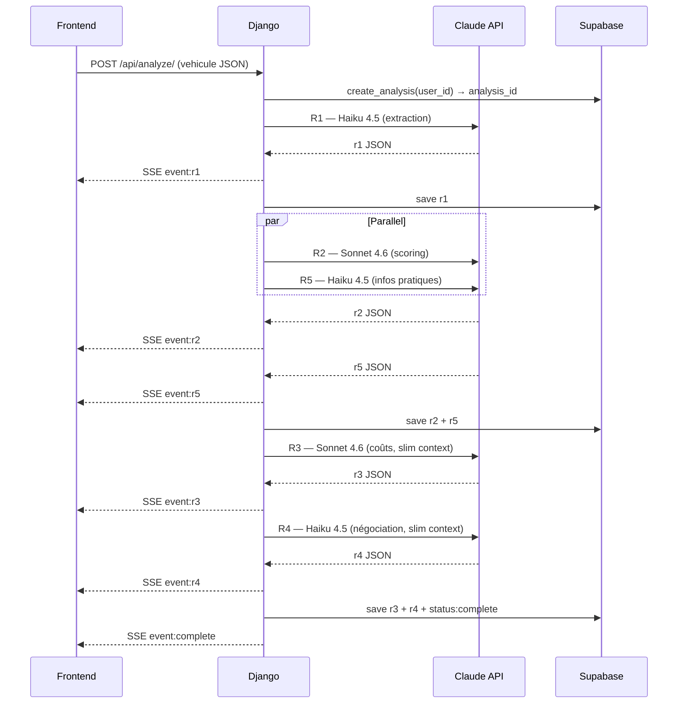
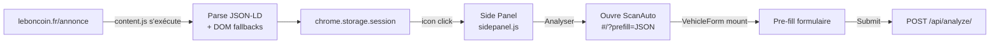
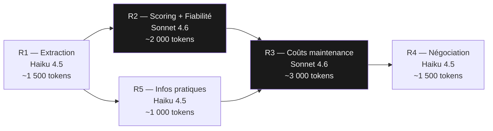
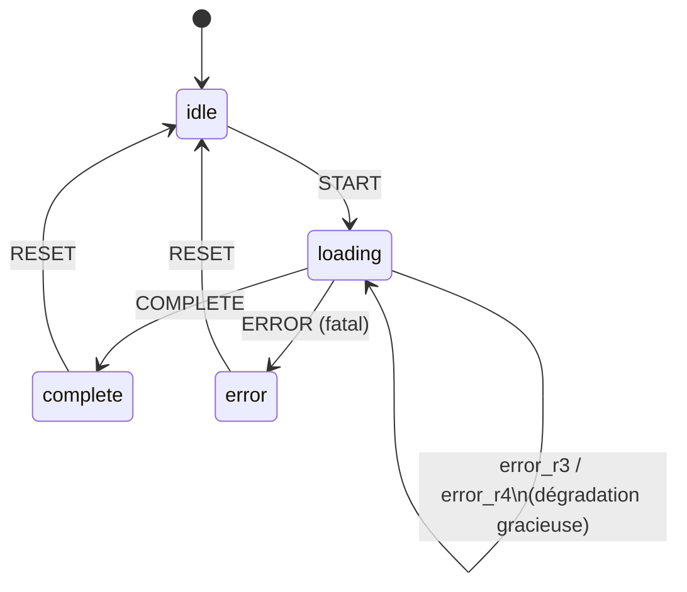
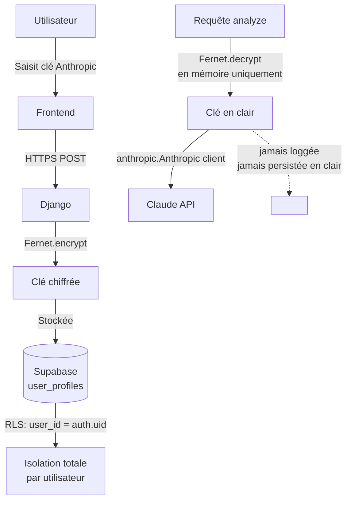

## Contexte

ScanAuto est une application SaaS full-stack qui génère un rapport d'analyse complet sur une annonce de voiture d'occasion. L'utilisateur colle une URL ou un texte brut — leboncoin, lacentrale, AutoScout24 — et reçoit en moins de 60 secondes : un score global, une analyse de fiabilité moteur, une projection de coûts sur 5 ans et une stratégie de négociation argumentée. Le projet est né d'un constat simple : les acheteurs de véhicules d'occasion n'ont pas les outils pour évaluer rapidement si une annonce est honnête ou piégée.

## Stack & Architecture

- **React 18 + Vite** — SPA avec routing hash-based (sans serveur), lazy loading par page, `useReducer` pour la gestion d'état de l'analyse. Vite a été choisi pour la rapidité du dev server et la simplicité de configuration comparé à CRA.
- **Tailwind CSS 3 + CSS variables** — Système de couleurs monochrome défini en variables CSS (`--bg`, `--surface`, `--accent`…), switchable dark/light sans JavaScript. Typographie Space Grotesk (display) + Inter (corps).
- **Django 4.2 + DRF** — Backend stateless : aucune base de données locale (`DATABASES = {}`), pas de migrations. Choix assumé pour un backend purement orienté orchestration d'API.
- **Supabase** — Auth JWT + PostgreSQL avec RLS (Row-Level Security). Chaque table filtre sur `user_id = auth.uid()` côté base : isolation des données sans logique applicative supplémentaire.
- **Anthropic Claude API (anthropic==0.40.0)** — Haiku 4.5 pour les étapes simples/rapides (extraction, négociation, infos pratiques), Sonnet 4.6 pour les étapes analytiques (scoring, coûts de maintenance). Prompt caching `ephemeral` sur tous les system prompts.
- **Firecrawl** — Extraction Markdown depuis les URLs d'annonces. Gère les protections anti-bot sans parsing HTML manuel ; le Markdown produit est directement injectable dans Claude.
- **Gunicorn** — 2 workers, 4 threads, timeout 300s pour les streams SSE longs.
- **Chrome Extension MV3** — Content script sur leboncoin.fr, side panel, service worker. Aucun build step — JavaScript natif.

## Points techniques notables

- **Pipeline 5 étapes avec parallélisme Python** : R1 (extraction) → R2+R5 en parallèle via `threading.Thread` + `Queue` (scoring + infos pratiques) → R3 (coûts maintenance) → R4 (négociation). Le GIL Python ne bloque pas les I/O réseau : le gain est réel (~30% de temps total).

- **Calculs côté serveur avant tout appel LLM** : `km_par_an`, `age_vehicule`, `positionnement_pourcentage`, projections kilométriques à 2 et 5 ans — tous calculés en Python avant d'être injectés comme faits immuables dans les prompts. Évite les erreurs de calcul des LLMs sur des valeurs critiques.

- **Streaming SSE progressif** : chaque étape complète émet un `event: r1|r2|…|complete` en SSE. Le frontend dispatche chaque événement dans un reducer et révèle les sections du rapport au fur et à mesure. L'utilisateur voit le rapport se construire en temps réel sans attendre la fin du pipeline.

- **Context slimming pour R3 et R4** : ces étapes reçoivent uniquement les champs pertinents de R1/R2 (pas le JSON complet), pour éviter le token bloat sur Sonnet. L'économie est d'environ 30-40% de tokens d'input sur ces deux appels.

- **BYOK chiffré (Bring Your Own Key)** : les clés Anthropic des utilisateurs sont chiffrées server-side avec Fernet (cryptography lib), déchiffrées en mémoire uniquement au moment de l'appel. Le backend ne stocke jamais la clé en clair ; les utilisateurs gardent le contrôle de leurs quotas.

- **Extension Chrome MV3 — extraction JSON-LD** : le content script parse le `@type:Vehicle` JSON-LD de leboncoin en priorité (donnée structurée fiable), avec 4 stratégies de fallback sur le DOM pour les champs absents du JSON-LD (critères, photos, description). Les données transitent via `chrome.storage.session` vers le side panel, puis vers l'app via URL prefill (`#/?prefill=<JSON>`).

- **Dégradation gracieuse** : R3 et R4 peuvent échouer (timeout, erreur API) sans bloquer le rapport. Le frontend affiche un état d'erreur localisé sur la section concernée ; les sections précédentes restent affichées.

## Ce que j'ai appris / apporté

Le challenge principal a été la conception du pipeline d'orchestration : gérer la dépendance entre étapes, le parallélisme contrôlé, les timeouts et la propagation d'erreurs partielles, tout en maintenant un streaming fluide vers le client. Cela m'a forcé à penser chaque prompt comme une interface contractuelle — inputs stricts, outputs JSON schématisés, règles métier explicites pour éviter les hallucinations sur des données financières.

---

## Schémas

### Architecture globale

---

### Pipeline d'analyse (séquence)

---

### Flux extension Chrome → app

---

### Sélection du modèle par étape

---

### Gestion d'état frontend (reducer)

---

### Architecture de sécurité BYOK

